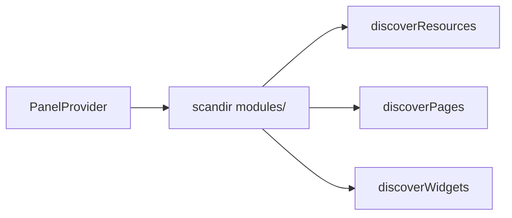

# Architecture Spec — Picksto Laravel Service

## Bootstrap chain

1. [`bootstrap/app.php`](../../bootstrap/app.php) — routing (`routes/web/web.php`), middleware aliases (`role`, `admin`), API exception JSON rendering.
2. [`bootstrap/providers.php`](../../bootstrap/providers.php) — registers all service providers in order.
3. [`config/app.php`](../../config/app.php) — minimal Laravel 12 app config (name, locale, key).

## Service providers

| Provider | Role |
|----------|------|
| `Modules\Auth\Providers\AuthServiceProvider` | Sessions + password reset migrations |
| `App\Providers\ApplicationServiceProvider` | Rate limiting, model strict mode, DB safeguards, **LanguageSwitch** config |
| `App\Providers\Filament\AdminPanelProvider` | Admin panel + module discovery |
| `App\Providers\Filament\ClientPanelProvider` | Client panel + module discovery |
| `App\Providers\ScrambleServiceProvider` | API docs (Scramble) |
| `Modules\*\Providers\*ServiceProvider` (×16) | Per-module migrations, translations, views |

## Filament panel discovery



Namespace pattern: `Modules\{Module}\Filament\{Admin|Client}\{Resources|Pages|Widgets}`.

Paths scanned per module:

- `modules/{Module}/Filament/Admin/Resources`
- `modules/{Module}/Filament/Admin/Pages`
- `modules/{Module}/Filament/Admin/Widgets`
- (same for `Client`)

**Manual registration:** Analytics widgets in `AdminPanelProvider::widgets([...])`.

## Panel configuration

[`config/panels.php`](../../config/panels.php):

| Key | Admin | Client |
|-----|-------|--------|
| `id` | `admin` | `client` |
| `path` | `admin` | `client` |
| Brand | Picksto Admin | Picksto Client |
| Primary color | Amber | Sky |

Both panels: SPA, login, `SpatieTranslatablePlugin` (`en`, `ar`).

Admin only: `->profile(EditProfile::class)`, dashboard widgets.

Client: `->profile(ProfilePage::class)` (user module).

## Module inventory

| Module | Migrations | Routes file | Admin Filament | Client Filament |
|--------|------------|-------------|----------------|-----------------|
| Analytics | — | missing | Widgets only | — |
| Auth | sessions, password_reset | missing | — | — |
| Currency | currency_settings | missing | Resource + pages | CurrencyPage |
| Download | downloads | **web.php** | Resource | DownloadsPage |
| Language | languages | — | Resource | — |
| LemonSqueezy | — | **web.php** (webhook) | API resources | — |
| Package | packages | missing | Resource | PlansPage |
| Payment | payment_gateways | missing | Resource | Schemas only |
| Product | products | missing | Resource | CatalogPage |
| Referral | 3 tables | missing | Resource + settings + rewards | ReferralPage |
| Settings | settings | missing | Resource | SettingsPage |
| Subscription | subscriptions | missing | Resource | SubscriptionPage |
| SubscriptionRequest | subscription_requests | — | Resource | MySubscriptionRequestResource |
| TestProvider | — | missing | — | — |
| Ticket | tickets, replies | missing | Resource + replies RM | TicketResource |
| Upload | — | missing | — | — |
| User | users, user_settings | missing | Resource + EditProfile | ProfilePage |
| Verification | 2 tables | missing | Resource + settings page | VerificationPage |

## Autoloading

[`composer.json`](../../composer.json):

```json
"Modules\\": "modules/"
```

## Legacy surfaces (deprecated)

- [`resources/views/modules/`](../../resources/views/modules/) — pre-Filament Blade UIs.
- [`routes/web/web.php`](../../routes/web/web.php) — empty; panels own `/admin` and `/client`.
- Most `loadRoutes()` in module providers point to non-existent `Routes/web.php`.

## Language switch

Configured in `ApplicationServiceProvider::boot()` via `BezhanSalleh\LanguageSwitch\LanguageSwitch::configureUsing()` — locales `en`, `ar`, visible inside panels.
