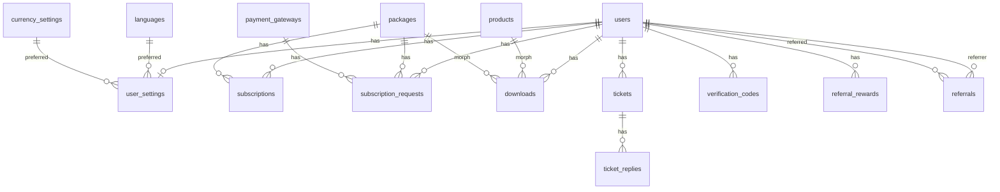

# Data Model Spec

## Entity relationship overview

## Tables by module

| Table | Module | Model |
|-------|--------|-------|
| `users` | User | `UserModel` |
| `user_settings` | User | `UserSettingModel` |
| `packages` | Package | `PackageModel` |
| `subscriptions` | Subscription | `SubscriptionModel` |
| `subscription_requests` | SubscriptionRequest | `SubscriptionRequestModel` |
| `products` | Product | `ProductModel` |
| `downloads` | Download | `DownloadModel` |
| `payment_gateways` | Payment | `PaymentGatewayModel` |
| `tickets` | Ticket | `TicketModel` |
| `ticket_replies` | Ticket | `TicketReplyModel` |
| `referrals` | Referral | `ReferralModel` |
| `referral_settings` | Referral | `ReferralSettingModel` (singleton) |
| `referral_rewards` | Referral | `ReferralRewardModel` |
| `verification_codes` | Verification | `VerificationCodeModel` |
| `verification_settings` | Verification | `VerificationSettingModel` (singleton) |
| `settings` | Settings | `SettingModel` |
| `languages` | Language | `LanguageModel` |
| `currency_settings` | Currency | `CurrencySettingModel` |
| `sessions`, `password_reset_tokens` | Auth | — |
| `cache`, `jobs` | Core | — |

## Model relations (implemented)

### UserModel

- `setting()` → HasOne `UserSettingModel`
- `subscriptions()` → HasMany `SubscriptionModel`
- `referrals()` → HasMany self (`referred_by`)
- `referrer()` → BelongsTo self

### UserSettingModel

- `user()`, `language()`, `currency()`

### PackageModel

- `subscriptions()`, `downloads()` (morphMany)

### ProductModel

- `downloads()` (morphMany)

### SubscriptionModel

- `user()`, `package()`

### SubscriptionRequestModel

- `user()`, `package()`, `gateway()`, `approver()` (`approved_by`)

### DownloadModel

- `user()`, `downloadable()` (morphTo: `product` | `package`)

### TicketModel / TicketReplyModel

- Ticket: `user()`, `replies()`
- Reply: `ticket()`, `user()`

### ReferralModel

- `referrer()`, `referred()`

### ReferralRewardModel

- `user()`

### VerificationCodeModel

- `user()`

## Morph map

In `DownloadServiceProvider`:

| Alias | Class |
|-------|-------|
| `product` | `Modules\Product\Models\ProductModel` |
| `package` | `Modules\Package\Models\PackageModel` |

## Schema fixes applied

| Issue | Resolution |
|-------|------------|
| `UserModel` cast `email_verified_at` vs column `email_verified` (bool) | Cast `email_verified` as boolean |
| `TicketModel` cast `is_admin` (no column) | Removed invalid cast |
| `config/auth.php` missing env defaults | Defaults: `web`, `UserModel` |
| `.env.example` missing auth vars | Added `AUTH_GUARD`, `AUTH_MODEL` |

## Translatable columns

| Model | JSON columns |
|-------|----------------|
| `PackageModel` | `name`, `description` |
| `ProductModel` | `name`, `description` |

## Singleton settings rows

| Model | Admin UI |
|-------|----------|
| `VerificationSettingModel` | `VerificationSettings` page |
| `ReferralSettingModel` | `ReferralSettings` page |
| `SettingModel` | `SettingResource` (key/value CRUD) |
